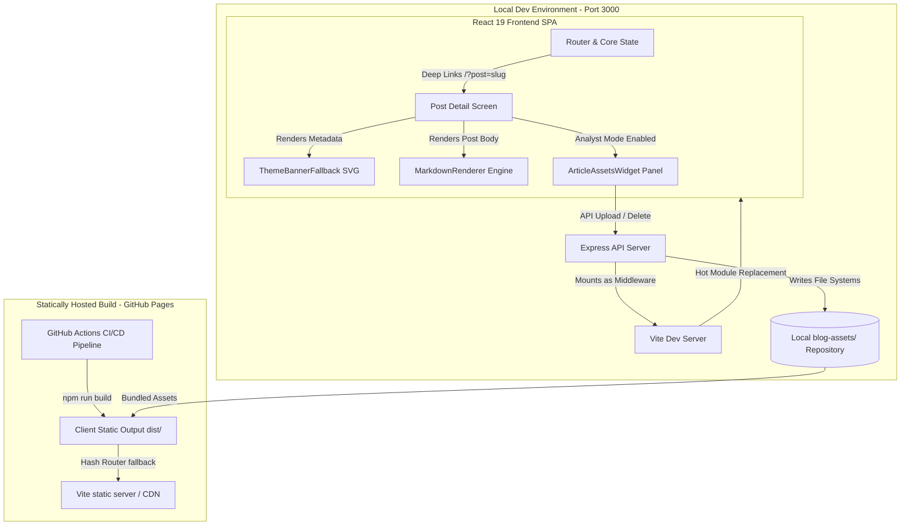
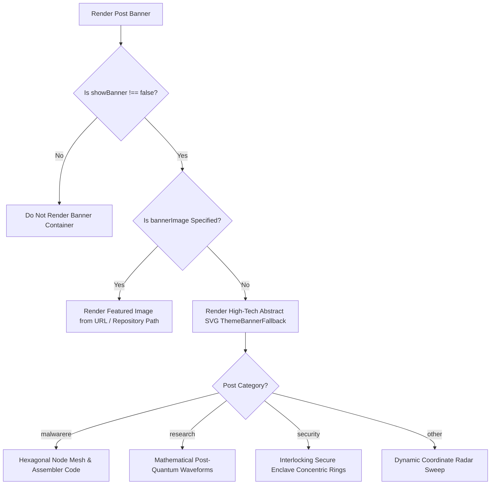

# OffSecIntel - System Architecture & Developer Documentation

Welcome to the **OffSecIntel Security Publications Portal** developer guide. This document details the architectural blueprint, data structures, backend APIs, and step-by-step instructions for upgrading this platform to a fully dynamic enterprise database backend.

---

## 🏗️ 1. System Architecture

The application is structured as a **hybrid full-stack (Express + Vite)** system designed to operate seamlessly across both development workstations and zero-overhead static hosting.

### System Architecture Map



### Development Architecture
In development, Express acts as the primary host. The Vite development server is mounted as an internal middleware inside Express. This provides rapid feedback, live hot module reloading (HMR) for client assets, and instant API responses from the same port (`3000`).

### Production Architecture
During compilation (`npm run build`):
1. The **React SPA client** is compiled into optimized HTML, JS, and CSS inside `/dist`.
2. The **Express Backend Server** (`server.ts`) is bundled into a single-file CommonJS module (`dist/server.cjs`) using `esbuild`.
3. In production (`npm run start`), the bundled Express server boots and serves `/dist` as static assets while hosting the live API endpoints on `/api/*` and serving post assets from `/blog-assets/*`.

---

## 📂 2. File Directory Structures & Asset Management

To support robust asset isolation, each publication is associated with a distinct subdirectory under `/blog-assets/` matching its slug.

```
workspace/
├── blog-assets/                        <-- Managed separate asset directory structure
│   ├── operation-dreambus-campaign-mapping/
│   │   └── dreambus-ioc-matrix.csv
│   └── uncloaking-two-faced-android-game-il2cpp/
│       ├── decompiled-symbols-excerpt.txt
│       └── frida-intercept-script.js
├── src/
│   ├── authors/                        <-- Team member profile data (.md)
│   │   ├── nayan.md                    <-- Nayan Rande's profile & portfolio
│   │   ├── mandar.md                   <-- Mandar Kulkarni's profile & portfolio
│   │   └── offsec.md                   <-- General OffSecIntel team profile
│   ├── components/                     <-- Modular UI units
│   │   ├── ArticleAssetsWidget.tsx     <-- Newly Added Assets Explorer
│   │   ├── MarkdownRenderer.tsx
│   │   └── ThreatIntelPanel.tsx
│   ├── posts/                          <-- Static markdown publications catalog
│   │   ├── operation-dreambus-campaign-mapping.md
│   │   ├── quantum-resistance-cryptographic-enclaves.md
│   │   └── uncloaking-two-faced-android-game-il2cpp.md
│   ├── config.ts                       <-- Site menus and category structures
│   ├── App.tsx                         <-- Principal client controller
│   ├── theme.ts                        <-- Responsive theme definitions
│   └── types.ts                        <-- TypeScript model interfaces
└── server.ts                           <-- Backend Server & API routes
```

---

## 🔌 3. REST API Reference

The server exposes key JSON endpoints under the `/api` route.

### A. Post Assets Explorer

#### 1. List Assets per Blog Post
Returns a catalog of metadata for files inside `/blog-assets/:slug/`.
*   **Endpoint:** `GET /api/posts/:slug/assets`
*   **Response Status:** `200 OK`
*   **Response Body:**
    ```json
    [
      {
        "name": "frida-intercept-script.js",
        "size": 1824,
        "type": "code",
        "url": "/blog-assets/uncloaking-two-faced-android-game-il2cpp/frida-intercept-script.js",
        "updatedAt": "2026-07-07T06:40:00.000Z"
      }
    ]
    ```

#### 2. Upload Asset to Post Directory
Uploads an asset or image using a high-reliability Base64 channel, automatically creating the parent directory if necessary.
*   **Endpoint:** `POST /api/posts/:slug/assets`
*   **Request Body:**
    ```json
    {
      "filename": "payload-dump.bin",
      "content": "SGVsbG8gV29ybGQh..." // Base64 encoded file string
    }
    ```
*   **Response Status:** `200 OK`
*   **Response Body:**
    ```json
    {
      "success": true,
      "asset": {
        "name": "payload-dump.bin",
        "size": 12,
        "type": "file",
        "url": "/blog-assets/uncloaking-two-faced-android-game-il2cpp/payload-dump.bin",
        "updatedAt": "2026-07-07T06:44:00.000Z"
      }
    }
    ```

#### 3. Delete Asset
*   **Endpoint:** `DELETE /api/posts/:slug/assets/:filename`
*   **Response Status:** `200 OK`
*   **Response Body:**
    ```json
    { "success": true }
    ```

---

## 📈 4. Present Capabilities vs. Future Scope Blueprints

| Functionality | Existing Implementation (Current State) | Enterprise Dynamic Backend (Upgrade Target) |
| :--- | :--- | :--- |
| **Authentication** | Open access for listing; direct local upload without password requirements in sandbox. | Integrate standard JWT auth, OAuth 2.0 (e.g., Google Workspace/GitHub credentials) and route guards. |
| **Blog Articles** | Loaded statically from `/src/posts/*.md` via bundler globbing; metadata loaded locally. | Store articles, frontmatter, and logs inside a Cloud SQL (PostgreSQL) database using an ORM like Drizzle or Prisma. |
| **Draft Management** | Filtered during static markdown loading. If `published: false` or `draft: true`, the post is completely hidden from the user interface and client bundle. | Manage publication states via a database column (e.g. `status` as ENUM: 'draft', 'review', 'published'). |
| **Multipage Layout** | Run-time split on `<!-- pagebreak -->` with a stateful pagination component. | Render pages based on a structured database table of article sections or dynamic dynamic text chunks. |
| **Assets Storage** | Saved locally in `/blog-assets/<slug>/` on server file systems. | Move storage folders to Google Cloud Storage (GCS) buckets with signed-URL uploads for distributed high-speed CDN delivery. |
| **Threat Intel Assistant** | AI summaries, outlines, and IoC extractions powered by **Gemini 3.5 Flash** on demand. | Save extracted IoCs directly into a relational database table connected to security orchestration (SOAR) pipelines. |
| **Researcher Profiles** | Loaded dynamically from `/src/authors/*.md` parsed at runtime; includes full resume sections, certifications, and portfolio items. | Store researcher details, skills, experience, and interests in structured tables within a PostgreSQL relational database. |

---

## 🛠️ 5. Step-by-Step Backend Upgrade Blueprint

If a future developer decides to transition this project to a robust cloud database and cloud-based file storage system, follow these recommended integration stages:

### Step A: Connect a Relational Database (Cloud SQL & Drizzle)
1.  **Define Schema:** Add `src/db/schema.ts` to represent posts and assets:
    ```typescript
    import { pgTable, text, timestamp, boolean, integer, jsonb } from "drizzle-orm/pg-core";

    export const posts = pgTable("posts", {
      id: text("id").primaryKey(),
      title: text("title").notNull(),
      slug: text("slug").notNull().unique(),
      summary: text("summary"),
      content: text("content").notNull(),
      category: text("category").notNull(),
      author: text("author").notNull(),
      date: text("date").notNull(),
      readTime: text("read_time").default("5 min read"),
      published: boolean("published").default(true),
      bannerImage: text("banner_image"),
      threatIntel: jsonb("threat_intel"), // Store IoCs, severity, MITRE data
      createdAt: timestamp("created_at").defaultNow()
    });

    export const assets = pgTable("assets", {
      id: text("id").primaryKey(),
      postSlug: text("post_slug").references(() => posts.slug),
      name: text("name").notNull(),
      size: integer("size").notNull(),
      type: text("type").notNull(),
      url: text("url").notNull(),
      createdAt: timestamp("created_at").defaultNow()
    });
    ```
2.  **Integrate Client Queries:** Replace the local loader in `/server.ts` with database selections:
    ```typescript
    import { db } from "./src/db";
    import { posts } from "./src/db/schema";

    app.get("/api/posts", async (req, res) => {
      const allPosts = await db.select().from(posts);
      res.json(allPosts);
    });
    ```

### Step B: Move Assets to Google Cloud Storage (GCS)
1.  **Add GCS SDK:** Install `@google-cloud/storage`.
2.  **Rewrite Upload API:** Replace native `fs.writeFileSync` inside `/server.ts` with GCS bucket uploads:
    ```typescript
    import { Storage } from "@google-cloud/storage";
    const storage = new Storage();
    const bucket = storage.bucket(process.env.GCS_BUCKET_NAME);

    app.post("/api/posts/:slug/assets", async (req, res) => {
      const { slug } = req.params;
      const { filename, content } = req.body;
      const file = bucket.file(`blog-assets/${slug}/${filename}`);
      
      await file.save(Buffer.from(content, "base64"), {
        resumable: false,
        metadata: { contentType: getContentType(filename) }
      });
      
      const publicUrl = `https://storage.googleapis.com/${bucket.name}/${file.name}`;
      res.json({ success: true, url: publicUrl });
    });
    ```

### Step C: Secure Uploads with JWT Auth
1.  **Add Auth Middleware:** Guard `POST` and `DELETE` endpoints:
    ```typescript
    import jwt from "jsonwebtoken";

    export function authenticateToken(req, res, next) {
      const authHeader = req.headers['authorization'];
      const token = authHeader && authHeader.split(' ')[1];
      if (!token) return res.sendStatus(401);

      jwt.verify(token, process.env.ACCESS_TOKEN_SECRET, (err, user) => {
        if (err) return res.sendStatus(403);
        req.user = user;
        next();
      });
    }

    app.post("/api/posts/:slug/assets", authenticateToken, (req, res) => { ... });
    ```

---

## 🔒 6. Security Hardening Checklist

When publishing this portal on public production endpoints:
- **Rate-limit file uploads** inside Express using `express-rate-limit` to prevent denial-of-service (DoS) storage exhaustion.
- **Sanitize file names** on upload using regex (e.g., `filename.replace(/[^a-zA-Z0-9.-]/g, "_")`) to prevent directory traversal attacks (e.g., `../../etc/passwd`).
- **Restrict uploaded file types** on the server to prevent malicious executable injection if server-side processing is introduced later.

---

## 🔗 7. URL Routing & Unified URI Construction

To support reliable routing on static hosting environments like **GitHub Pages** (where standard browser-history rewrites or custom server redirects are unavailable), the platform utilizes a unified, hash-compatible URL structure.

### A. Articles / Publications URIs
All publication URIs are resolved using the `post` or `p` query parameters.
- **Development Router Format:** `http://localhost:3000/?post=<slug>` (or `?p=<slug>`)
- **Static Hosting Router Format (GitHub Pages compatible):** `https://<user>.github.io/<repo>/?post=<slug>`
  * *Unified Resolution:* The client parses `window.location.search` at startup to load the requested article slug. If a user directly accesses a URL or refreshes, the search parameter ensures the root index.html serves and parses the exact content.

### B. Author / Researcher Profiles URIs
Author/Researcher profiles are identified by their lowercase ID (e.g., `nayan`, `mandar`) corresponding to their markdown file name in `src/authors/<id>.md`.
- **Author Bio Navigation:** Resolved when the reader clicks on the author card in the primary UI, which prompts the `<AuthorDossier />` profile model overlay.

---

## 📝 8. Editorial Pipeline & Metadata Lifecycle

For security and privacy compliance (particularly on public static pages where anyone has repo access), the editorial pipeline uses three independent markdown header fields in `/src/posts/*.md` files:

### A. Header Definitions
1. **`published: <boolean>`** (e.g., `published: true` or `published: false`)
   - Determines whether the article is cleared to be built and served. 
2. **`draft: <boolean>`** (e.g., `draft: true` or `draft: false`)
   - Indicates if the article is actively in development or peer-review.
3. **`showAbstract: <boolean>`** (e.g., `showAbstract: true` or `showAbstract: false`)
   - Optional. Controls the visibility of the "Abstract / Executive Summary" block at the top of the article. Setting this to `false` prevents redundancy for articles where authors prefer only the primary summary view.
4. **`showBanner: <boolean>`** (e.g., `showBanner: true` or `showBanner: false`)
   - Optional. Determines whether the header banner (featured image or abstract theme pattern) should be displayed inside the article page. Default is `true`.

### B. Resolution Rules
To prevent leakage of unpublished research or drafts on public repositories:
- Any article where `published: false` OR `draft: true` is **strictly excluded** from the static loading routine during the Vite compilation phase.
- The `SHOW_DRAFTS` UI toggle is completely removed from the frontend. This guarantees that drafts are never sent to the static client bundle in production, maintaining publication integrity.

### C. On-Demand Multipage Layout (pagebreak) & Advanced Markdown Rendering
To optimize the readability of deep-dive analyses without cluttering shorter bulletins:
- **Automatic Single-Page Rendering:** Articles are rendered as a single cohesive document by default.
- **On-Demand Splitting:** If and only if an article is extremely lengthy, editors can insert the HTML comment `<!-- pagebreak -->` within the markdown source.
- **Stateful Navigation:** When one or more `<!-- pagebreak -->` tags are detected, the frontend automatically activates the `TacticalPageNavigator` component, enabling step-by-step progress controls. If no pagebreak is present, the article is delivered in full with a standard single-page layout.
- **Header Levels:** The `MarkdownRenderer` handles all header depths up to H6 (`######`), with optimized, responsive visual style configurations for sub-headings.
- **Advanced List Parsing:** Supports both unordered (`-`, `*`) and ordered lists (e.g., `1.`, `2.`) with dedicated rendering containers, nested indents, and bullet style definitions, preventing multi-line lists from folding into simple text paragraphs.
- **Markdown Image Rendering:** The renderer parses standard Markdown image syntax (``) to display responsive, centered figures framed in subtle borders, soft shadows, and clean, italicized caption labels displaying the alternate text.

### D. Table of Contents Pagination Sync
To prevent broken anchor links when articles are split into multiple pages:
- **Full-Document Mapping:** The `TableOfContents` component parses the full `activePost.content` (cross-page outline) rather than just the current page's slice, recording exactly which page contains each header.
- **Cross-Page Transitions:** Clicking a header that lies on a different page automatically fires `onPageChange` (updating `activePostPageIndex`), waits for the DOM to update, and smoothly scrolls the user to the destination header (`scroll-mt-20` offset).
- **Page-Aware Active State:** The TOC scroll-spy only highlights the active headers present on the *currently* viewed page.

### E. Malware & Target Mobile APK Samples
To facilitate dynamic analysis for reverse engineers and analysts, the portal natively supports mobile APK assets:
- **Upload Support:** Authors can upload mobile APK files via the Base64 asset upload channel by enabling `AUTHOR_WRITE` mode.
- **Visual Warning Banners:** When any file ending in `.apk` is present in the publication's assets directory, the `ArticleAssetsWidget` automatically renders a highly visible, crimson-themed `ANALYST_RESOURCE: APK_TARGET` warning banner with a prominent direct download button.
- **Payload Badging:** Inside the assets listing, APK samples are flagged with a customized warning badge (`APK_SAMPLE`) and a pulsing smartphone icon to indicate their dynamic binary payload status.

### F. Zero-Maintenance Decisional Banner & Falling-Back Engine
From a static blog site's perspective, editorial changes must be automatic and driven solely by metadata rather than interactive toggles. The display of banners inside an article follows a strict, zero-overhead decisional flowchart:



*   **Dynamic Fallback Patterns:** If no `bannerImage` is specified for a post, the `ThemeBannerFallback` component renders an inline SVG layout representing the topic's category. This incorporates category-specific visual motifs (such as a hexagonal mesh with binary streams for malware research, mathematical wave equations for security research, and concentric security enclaves for host security) mapped to the post's exact `themeColor` scheme.
